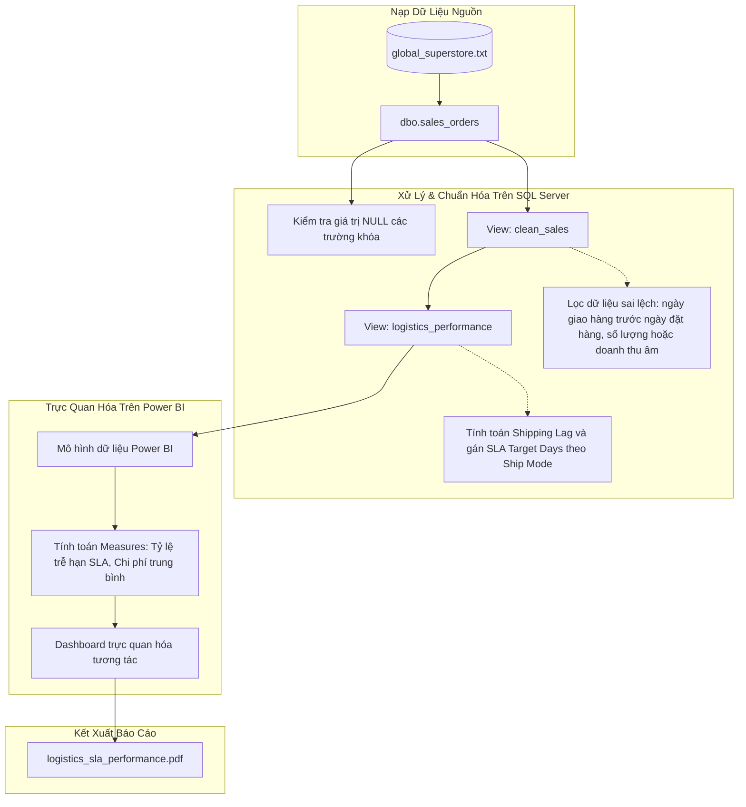

# PHÂN TÍCH HIỆU SUẤT LOGISTICS VÀ ĐÁP ỨNG CAM KẾT CHẤT LƯỢNG DỊCH VỤ (SLA)

Dự án này thực hiện quy trình xử lý dữ liệu tổng thể nhằm phân tích hoạt động logistics và đánh giá mức độ tuân thủ Cam kết Chất lượng Dịch vụ (Service Level Agreement - SLA) dựa trên bộ dữ liệu bán hàng toàn cầu Global Superstore. Dự án kết hợp giữa việc chuẩn hóa dữ liệu bằng SQL Server và xây dựng báo cáo phân tích trực quan tương tác trên Power BI, nhằm giúp doanh nghiệp nhận diện các điểm nghẽn trong chuỗi cung ứng và tối ưu hóa thời gian giao hàng.

## Mô tả ngắn gọn

Dự án sử dụng cơ sở dữ liệu giao dịch bán hàng toàn cầu để:
- Thực hiện kiểm tra chất lượng dữ liệu, phát hiện các giá trị khuyết thiếu (NULL) và thiết lập các điều kiện làm sạch nghiệp vụ (loại bỏ giao dịch có số lượng hoặc doanh thu âm, chiết khấu nằm ngoài khoảng quy định).
- Tính toán độ trễ giao hàng thực tế (Shipping Lag) bằng khoảng chênh lệch số ngày giữa ngày đặt hàng và ngày giao hàng thực tế.
- Thiết lập mô hình giả định về mục tiêu SLA tương ứng với từng phương thức vận chuyển: Same Day (0 ngày), First Class (2 ngày), Second Class (2 ngày) và Standard (6 ngày).
- Trực quan hóa tỷ lệ hoàn thành SLA, phân tích xu hướng giao hàng trễ hạn theo khu vực địa lý, nhóm sản phẩm và phân khúc khách hàng trên dashboard Power BI phục vụ cho ra quyết định quản trị chuỗi cung ứng.

## Các tính năng chính

- Thiết lập cơ sở dữ liệu và làm sạch dữ liệu (SQL Views):
  - View clean_sales: Tự động loại bỏ các bản ghi không hợp lệ trong hệ thống như ngày giao hàng trước ngày đặt hàng, số lượng hoặc doanh thu bằng 0, hoặc tỷ lệ chiết khấu không hợp lệ (nằm ngoài khoảng từ 0% đến 100%).
  - View logistics_performance: Thực hiện tính toán khoảng thời gian giao hàng thực tế và gán nhãn thời gian SLA cam kết dựa trên phương thức vận chuyển để phục vụ phân tích hiệu suất.

- Trực quan hóa hiệu suất vận hành (Power BI Dashboard):
  - Tổng quan hiệu suất: Trình bày các chỉ số đo lường hiệu suất cốt lõi (KPIs) bao gồm tổng doanh số, tổng số lượng đơn hàng, chi phí vận chuyển và thời gian giao hàng trung bình toàn cầu.
  - Phân tích đáp ứng SLA: Phân nhóm các đơn hàng thành giao đúng hạn và trễ hạn dựa trên chỉ số so sánh giữa thời gian giao hàng thực tế và SLA cam kết.
  - Phân tích chi phí và thứ tự ưu tiên: Phân tích sự tương quan giữa chi phí vận chuyển, mức độ ưu tiên của đơn đặt hàng và phương thức giao hàng được lựa chọn trên các khu vực thị trường khác nhau.

- Báo cáo phân tích tĩnh (PDF Report):
  - Cung cấp bản tóm tắt tĩnh định dạng PDF nhằm phục vụ công tác báo cáo định kỳ cho ban điều hành về tình hình vận hành logistics và phân bổ chi phí chuỗi cung ứng toàn cầu.

## Hướng dẫn cài đặt và chạy thử

### Yêu cầu hệ thống

- Hệ quản trị cơ sở dữ liệu Microsoft SQL Server (hoặc hệ quản trị cơ sở dữ liệu quan hệ tương đương).
- Ứng dụng Microsoft Power BI Desktop để xem và tương tác với dashboard.
- Phần mềm hỗ trợ đọc định dạng PDF.

### Quy trình triển khai và kiểm thử

1. Tải toàn bộ thư mục dự án về máy tính cá nhân.
2. Nạp dữ liệu nguồn từ tệp tin data/global_superstore.txt vào bảng dbo.sales_orders trong hệ quản trị cơ sở dữ liệu SQL Server của bạn.
3. Mở và thực thi kịch bản truy vấn trong tệp tin sql/data_cleaning_and_views.sql để thiết lập hai cấu trúc view: dbo.clean_sales và dbo.logistics_performance.
4. Khởi chạy tệp tin powerbi/logistics_sla_performance.pbix bằng Power BI Desktop. Cập nhật đường dẫn kết nối nguồn dữ liệu (Data Source Settings) trỏ đến máy chủ SQL Server và cơ sở dữ liệu chứa các view đã tạo ở bước trên.
5. Xem báo cáo tóm tắt hiệu suất đã được kết xuất sẵn tại thư mục reports/logistics_sla_performance.pdf.

## Cấu trúc thư mục

Dự án được tổ chức theo cấu trúc tiêu chuẩn để quản lý dữ liệu, truy vấn và giao diện báo cáo chuyên nghiệp:

```text
.
├── data/
│   └── global_superstore.txt           # Dữ liệu giao dịch bán hàng gốc (định dạng văn bản)
├── powerbi/
│   └── logistics_sla_performance.pbix  # Dashboard Power BI tương tác phân tích hiệu suất
├── reports/
│   └── logistics_sla_performance.pdf   # Báo cáo hiệu suất logistics định dạng PDF
├── sql/
│   └── data_cleaning_and_views.sql     # Truy vấn SQL kiểm tra chất lượng, làm sạch và tạo view dữ liệu
├── .gitignore                          # Cấu hình các tệp tin tạm thời không theo dõi bởi git
├── LICENSE                             # Bản quyền mã nguồn mở MIT của dự án
└── README.md                           # Tài liệu hướng dẫn sử dụng và mô tả dự án
```

## Sơ đồ luồng dữ liệu (Dataflow)

Quy trình luân chuyển và biến đổi dữ liệu trong dự án được biểu diễn theo sơ đồ dưới đây:



## Bản quyền

Dự án này được phân phối dưới dạng mã nguồn mở theo các điều khoản của MIT License. Chi tiết vui lòng tham khảo file LICENSE đính kèm.
