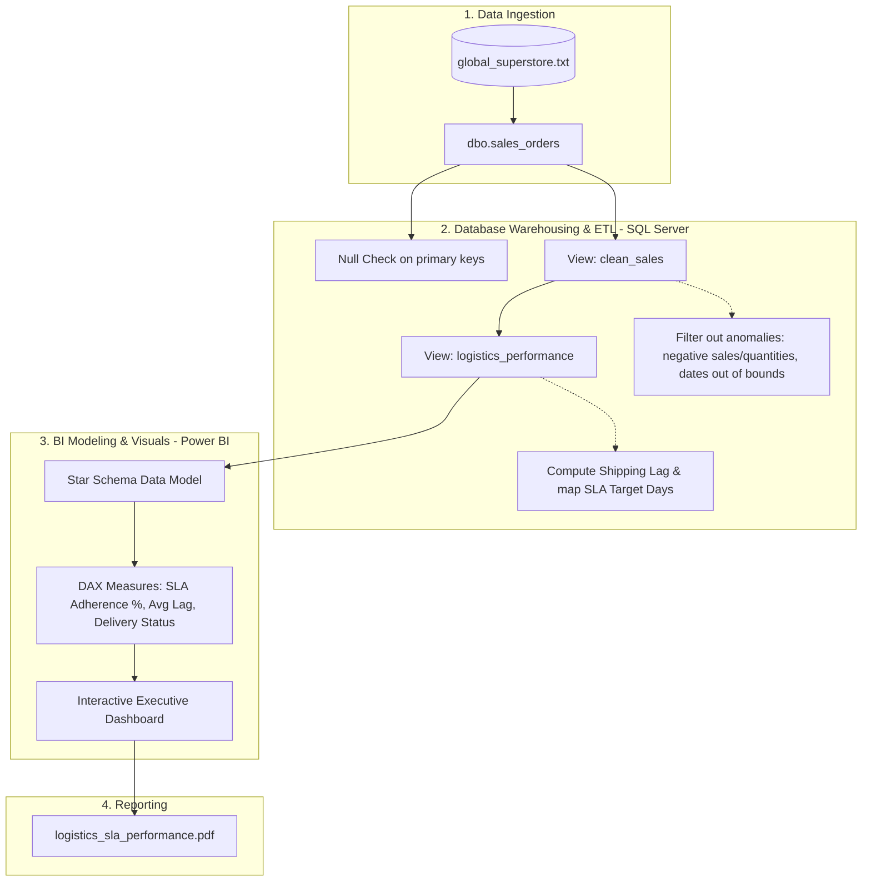

# Supply Chain Logistics & SLA Compliance Analysis

This project implements an end-to-end data analytics workflow to evaluate logistics performance and Service Level Agreement (SLA) compliance using the Global Superstore retail dataset. The project combines SQL Server for data warehousing/ETL and Power BI for building interactive analytical dashboards, helping businesses identify supply chain bottlenecks and optimize shipping delays.

*Note: For the Vietnamese version of this document, please see below or contact the author.*

---

## 📌 Business Problem & Goals

Logistics performance is critical to retail customer satisfaction and retention. This project simulates a real-world scenario where the business has predefined Service Level Agreements (SLAs) for different shipping modes:
- **Same Day**: 0 days
- **First Class**: 2 days
- **Second Class**: 4 days
- **Standard Class**: 6 days

The primary goals are to:
1. **Clean and Prepare Data**: Address missing values, filter out transaction anomalies, and compute shipping lag.
2. **Track SLA Adherence**: Segment orders into "On Time" and "Late" deliveries to identify weak spots in the supply chain.
3. **Analyze Cost vs. Priority**: Correlate shipping costs, order priority levels, and shipping modes across global markets to identify cost-saving opportunities.

---

## 🛠 Key Features & Technical Details

### 1. Database Setup & Data Cleaning (SQL Server)
* **View [clean_sales](file:///d:/GITHUB_PROJECT/Portfolio-Projects/Global-Superstore-Logistics-Project/sql/data_cleaning_and_views.sql#L36)**: Standardizes and cleans the raw transaction database by removing anomalies (e.g., negative sales/quantities, invalid discounts, or shipments occurring before the order date).
* **View [logistics_performance](file:///d:/GITHUB_PROJECT/Portfolio-Projects/Global-Superstore-Logistics-Project/sql/data_cleaning_and_views.sql#L71)**: Calculates the `Shipping_Lag` (days between order and delivery) and assigns the corresponding `SLA_Target_Days` based on the shipping mode.

### 2. Interactive Performance Dashboard (Power BI)
* **Executive KPIs**: Displays global sales, order volume, average shipping cost, and average shipping lag.
* **SLA Performance Analysis**: Breaks down the percentage of orders meeting the SLA vs. late shipments across geographical regions, product categories, and customer segments.
* **Cost & Priority Correlation**: Highlights potential inefficiencies where low-priority orders are shipped using expensive shipping modes.

### 3. Executive Report (PDF)
* A static executive summary report is located in the [reports/](file:///d:/GITHUB_PROJECT/Portfolio-Projects/Global-Superstore-Logistics-Project/reports) folder to show how insights are prepared for senior leadership meetings.

---

## 📂 Project Structure

```text
.
├── data/
│   └── global_superstore.txt           # Raw transaction data (tab-separated text)
├── powerbi/
│   └── logistics_sla_performance.pbix  # Interactive Power BI dashboard
├── reports/
│   └── logistics_sla_performance.pdf   # Exported executive PDF report
├── sql/
│   └── data_cleaning_and_views.sql     # SQL scripts for ETL, data cleaning, and Views
├── .gitignore                          # Git ignore configurations
├── LICENSE                             # MIT License
└── README.md                           # Project documentation (This file)
```

---

## 🔄 Dataflow Diagram

The end-to-end data pipeline is modeled in the diagram below:



---

## 🚀 How to Run and Test

### Prerequisites
* **Microsoft SQL Server** (or compatible RDBMS).
* **Power BI Desktop** (for viewing the `.pbix` dashboard).
* A PDF reader.

### Step-by-Step Implementation
1. **Load Raw Data**: Import the dataset from `data/global_superstore.txt` into a SQL table named `dbo.sales_orders` in your database.
2. **Execute ETL Scripts**: Run the SQL script [data_cleaning_and_views.sql](file:///d:/GITHUB_PROJECT/Portfolio-Projects/Global-Superstore-Logistics-Project/sql/data_cleaning_and_views.sql) to create the views `dbo.clean_sales` and `dbo.logistics_performance`.
3. **Open Power BI Dashboard**: Open the file `powerbi/logistics_sla_performance.pbix` in Power BI Desktop.
4. **Change Data Source**: Go to *Data Source Settings* in Power BI and update the SQL Server connection string to point to your database server.
5. **View Executive Report**: Access `reports/logistics_sla_performance.pdf` for a direct PDF summary.

---

## 📜 License
This project is licensed under the MIT License. See the `LICENSE` file for details.

---

<details>
<summary>🇻🇳 Bản tiếng Việt (Vietnamese Version)</summary>

## PHÂN TÍCH HIỆU SUẤT LOGISTICS VÀ ĐÁP ỨNG CAM KẾT CHẤT LƯỢNG DỊCH VỤ (SLA)

Dự án này thực hiện quy trình xử lý dữ liệu tổng thể nhằm phân tích hoạt động logistics và đánh giá mức độ tuân thủ Cam kết Chất lượng Dịch vụ (SLA) dựa trên bộ dữ liệu bán hàng toàn cầu Global Superstore. Dự án kết hợp giữa việc chuẩn hóa dữ liệu bằng SQL Server và xây dựng báo cáo phân tích trực quan tương tác trên Power BI, nhằm giúp doanh nghiệp nhận diện các điểm nghẽn trong chuỗi cung ứng và tối ưu hóa thời gian giao hàng.

### Mục tiêu dự án
1. **Làm sạch dữ liệu**: Phát hiện giá trị trống, loại bỏ các giao dịch lỗi (doanh số, số lượng âm, chiết khấu sai).
2. **Tính toán thời gian giao hàng**: Tính toán độ trễ giao hàng thực tế (Shipping Lag) và gán nhãn mục tiêu SLA theo phương thức vận chuyển: Same Day (0 ngày), First Class (2 ngày), Second Class (4 ngày) và Standard (6 ngày).
3. **Trực quan hóa**: Phân tích tỷ lệ hoàn thành SLA, phân phối đơn trễ hạn và tối ưu hóa chi phí vận hành logistics trên Power BI.

</details>
