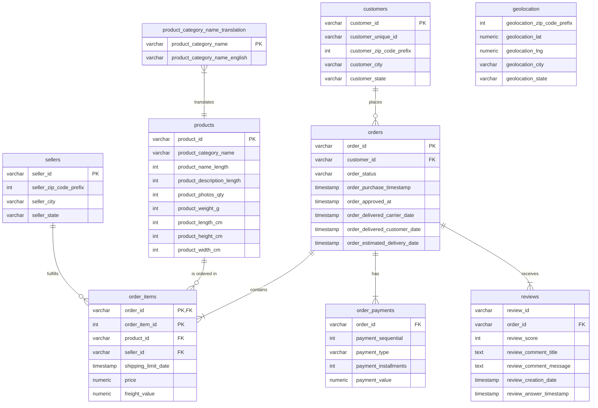

# E-commerce Sales & Customer Behavior Analysis (Olist Brazil)

This project performs a comprehensive end-to-end data analytics workflow on a public dataset from **Olist**—the largest e-commerce marketplace in Brazil—containing 100k+ orders from 2016 to 2018. It combines **SQL (PostgreSQL)** for database design, ETL, and complex business queries, with **Python (Pandas, Seaborn, Matplotlib)** for statistical analysis, cohort visualization, and actionable business insights.

*Note: For the Vietnamese version of this document, please see below.*

---

## Business Questions Addressed

This project solves 5 core e-commerce business problems:

### 1. Sales Growth & Cumulative Revenue Trend
* **Objective**: Measure month-over-month revenue growth to assess financial health and market expansion.
* **Solution**: Aggregated successful orders (`delivered`) by month using SQL window functions (`SUM() OVER`) and Python's cumulative summation (`cumsum`).

### 2. Customer Segmentation (RFM Analysis)
* **Objective**: Categorize customers into actionable groups (e.g., Champions, Loyalists, At Risk) to optimize marketing spend.
* **Solution**: Calculated three key metrics per unique customer:
  * Recency: Days since the last purchase.
  * Frequency: Total number of unique orders placed.
  * Monetary: Total amount spent.

### 3. Shipping Lag Impact on Customer Satisfaction (SLA vs. Review Scores)
* **Objective**: Quantify the impact of delivery delays on customer experience.
* **Solution**: Compared actual delivery dates (`order_delivered_customer_date`) with committed dates (`order_estimated_delivery_date`). Analyzed average review scores (`review_score`) for "On Time" vs. "Late" shipments.

### 4. High-Value Product Categories (Top 10 by Revenue)
* **Objective**: Identify the main product categories driving sales to prioritize vendor recruitment and advertising.
* **Solution**: Merged product catalogs, translated Portuguese category names to English, aggregated total revenue, and ranked categories.

### 5. Customer Retention Heatmap (Cohort Analysis)
* **Objective**: Measure customer loyalty and assess long-term platform stickiness.
* **Solution**: Grouped customers into monthly cohorts based on their first purchase month (`cohort_month`) and tracked the percentage of customers returning in subsequent months (`month_index`).

---

## Database Schema (ERD)

The relational database schema designed for this project is illustrated below. The source schema is saved in [olist.pgerd](file:///d:/GITHUB_PROJECT/Portfolio-Projects/Olist_Project/olist.pgerd) (openable in pgAdmin 4).



---

## Project Structure

```text
Olist_Project/
├── data/
│   ├── .gitkeep                             # Keeps directory structure in git
│   └── product_category_name_translation.csv # English-Portuguese translation mapping
├── sql/
│   └── olist_query.sql                      # SQL scripts (Schema, relationships, queries)
├── notebooks/
│   └── charts_analysis.ipynb                # Jupyter Notebook for Python analysis & plotting
├── images/
│   ├── monthly_revenue_trend.png            # Monthly & cumulative revenue trend plot
│   ├── rfm_monetary_distribution.png        # Customer spending distribution
│   ├── delivery_impact_reviews.png          # Impact of delayed shipping on review scores
│   └── top_10_categories_revenue.png        # Top 10 product categories by revenue
├── .gitignore                               # Excludes raw CSV data files (>125MB)
├── olist.pgerd                              # Entity-Relationship Diagram (ERD) file
├── requirements.txt                         # Required Python dependencies
└── README.md                                # Project documentation (This file)
```

---

## Key Insights & Business Recommendations

### 1. Revenue Trends & Seasonality
* **Insight**: Monthly sales peaked in **November 2017** due to Black Friday, hitting over **1.1 Million BRL**. The cumulative revenue shows a steady linear growth trajectory.
* **Action**: Prepare logistics and marketing budgets at least 3 months ahead of Q4 to handle seasonal spikes.


### 2. High Right-Skewed Customer Spending
* **Insight**: Over 90% of customers spend **under 200 BRL** per transaction. High-value orders (>1000 BRL) represent less than 1% of the database.
* **Action**: Introduce product bundles, cross-selling recommendations, and free-shipping thresholds (e.g., free shipping on orders > 150 BRL) to increase Average Order Value (AOV).


### 3. Critical Value of Logistics (SLA Adherence)
* **Insight**: Deliveries made **On Time** score an average of **4.30 / 5.0** in reviews. However, **Late** deliveries collapse the average score to **1.49 / 5.0**.
* **Action**: Logistics is a critical metric for Olist. The platform should penalize sellers who are slow to ship and establish SLA contracts with courier partners.


### 4. Category Winners
* **Insight**: **Health & Beauty** leads with 1.25M BRL in revenue, followed closely by **Watches & Gifts**, **Bed, Bath & Table**, and **Sports & Leisure**.
* **Action**: Prioritize these top 4 categories in marketing campaigns and acquire high-quality sellers for these groups.


### 5. Retention Bottleneck
* **Insight**: Cohort retention analysis reveals that the percentage of customers who return in Month 2 is **under 1%**. Olist struggles with customer retention.
* **Action**: Invest in customer loyalty programs, automated email remarketing, and personalized coupons to drive repeat purchases instead of solely relying on new user acquisition.

---

## How to Run the Project

### 1. Data Preparation
The raw dataset exceeds 120MB and is excluded via `.gitignore`. 
1. Download the zip dataset from Kaggle: [Brazilian E-Commerce Public Dataset by Olist](https://www.kaggle.com/datasets/olistbr/brazilian-ecommerce)
2. Extract all `.csv` files into the `Olist_Project/data/` directory.

### 2. Database Setup (PostgreSQL)
1. Create a database in pgAdmin or PostgreSQL terminal: `CREATE DATABASE olist_db;`
2. Open the SQL script [olist_query.sql](file:///d:/GITHUB_PROJECT/Portfolio-Projects/Olist_Project/sql/olist_query.sql).
3. Execute **Phase 1** and **Phase 2** to build tables and establish foreign keys.
4. Import the CSV files from the `data/` folder into their corresponding tables (order: independent tables first, then dependent tables).
5. Execute the business queries in **Phase 3**.

### 3. Jupyter Notebook Analysis
1. Navigate to the project directory and install the requirements:
   ```bash
   pip install -r requirements.txt
   ```
2. Launch the Jupyter server:
   ```bash
   jupyter notebook
   ```
3. Open `notebooks/charts_analysis.ipynb` and run the cells sequentially to regenerate the visualizations.

---

## License
This project is licensed under the MIT License.

---

<details>
<summary>Bản tiếng Việt (Vietnamese Version)</summary>

## PHÂN TÍCH HIỆU SUẤT KINH DOANH VÀ HÀNH VI KHÁCH HÀNG TRÊN NỀN TẢNG OLIST

Dự án này thực hiện quy trình phân tích dữ liệu toàn diện (End-to-End) trên bộ dữ liệu TMĐT thực tế của Olist (Brazil). Dự án kết hợp PostgreSQL để thiết kế database và xử lý truy vấn phức tạp, cùng Python (Pandas, Seaborn) để phân tích RFM, Cohort và trực quan hóa các phát hiện nghiệp vụ nhằm tối ưu vận hành.

### Các bài toán giải quyết:
1. Xu xu hướng doanh thu theo tháng và lũy kế.
2. Phân khúc khách hàng RFM (Recency, Frequency, Monetary).
3. Đánh giá tác động giao hàng trễ đến điểm review của khách hàng.
4. Top 10 danh mục sản phẩm mang lại doanh thu cao nhất.
5. Phân tích tỷ lệ giữ chân khách hàng (Cohort Retention).

</details>
