# NỀN TẢNG MÔ PHỎNG TRUYỀN TIN MÃ HÓA ĐẦU CUỐI VÀ PHÂN TÍCH MỐI ĐE DỌA AN NINH MẠNG

Secure Messenger là một ứng dụng web mô phỏng hệ thống truyền tin mã hóa đầu cuối (End-to-End Encryption - E2EE), được phát triển nhằm minh họa các khái niệm mật mã học hiện đại kết hợp với kịch bản mô phỏng tấn công thực tế dưới góc nhìn của một chuyên gia an ninh mạng hoặc tin tặc.

Dự án kết hợp giao diện trò chuyện trực quan cùng bảng điều khiển giám sát kỹ thuật (Ratchet Monitor) ở giữa, cho phép người dùng trực tiếp quan sát toàn bộ quy trình xử lý dữ liệu mật mã: từ trao đổi khóa Diffie-Hellman, mã hóa AES-256, kiểm tra tính toàn vẹn SHA-256, cho đến kịch bản tấn công XSS và chiếm đoạt tài khoản.

## Các tính năng chính

- Trao đổi khóa Diffie-Hellman (DH-256): Mô phỏng quy trình thỏa thuận khóa bí mật giữa Alice và Bob một cách trực quan.
- Mã hóa AES-256: Mã hóa nội dung tin nhắn bằng thuật toán AES-256 tiêu chuẩn công nghiệp.
- Mật mã Vigenere: Chế độ mã hóa thay thế tùy chọn để đối chiếu giữa mật mã cổ điển và mật mã đối xứng hiện đại.
- Kiểm tra tính toàn vẹn SHA-256: Băm dữ liệu truyền đi nhằm xác thực tin nhắn không bị can thiệp hay thay đổi trên đường truyền.
- Bảng giám sát Ratchet (Ratchet Monitor): Trực quan hóa cơ chế xoay vòng khóa (Double Ratchet) theo thời gian thực mỗi khi gửi hoặc nhận tin nhắn.
- Bảng điều khiển Hacker (Hacker Console): Mô phỏng các kỹ thuật tấn công XSS và chiếm đoạt phiên làm việc (Session Hijacking) của bên thứ ba (Eve).
- Giao diện trò chuyện ba cột: Bố cục trực quan hiển thị song song hộp thoại của Alice, Bảng giám sát Ratchet ở giữa và hộp thoại của Bob.
- Danh bạ liên lạc: Hỗ trợ mã hóa tin nhắn riêng biệt với 8 liên hệ mẫu, bao gồm cả tính năng gửi ảnh mã hóa.
- Chia sẻ hình ảnh: Tải và chuyển đổi dữ liệu hình ảnh thành dạng mã hóa trước khi truyền tải.
- Quản lý tài khoản: Chỉnh sửa thông tin cá nhân (tên hiển thị, email, ảnh đại diện) và theo dõi huy chương thành tích.
- Hỗ trợ song ngữ (Tiếng Việt và Tiếng Anh): Cho phép chuyển đổi giao diện ngôn ngữ tức thời.
- Chế độ giao diện Sáng / Tối: Thay đổi chủ đề giao diện linh hoạt.
- Chỉ báo trạng thái hoạt động: Hiển thị trạng thái đã xem (Seen) và bong bóng chỉ báo đang soạn tin nhắn (Typing).
- Màn hình chào mừng (Splash Screen): Hiệu ứng khởi động giả lập dòng code rơi phong cách điện ảnh.
- Hiệu ứng nền 3D Parallax: Lớp hình nền chuyển động theo tọa độ con trỏ chuột.
- Đồng bộ cơ sở dữ liệu Firebase: Kết nối và đồng bộ hóa tin nhắn thời gian thực qua Firebase Realtime Database.

## Kiến trúc mật mã và Luồng dữ liệu

Mỗi tin nhắn trong Secure Messenger đều trải qua quy trình mã hóa nghiêm ngặt trước khi được đồng bộ lên cơ sở dữ liệu:

1. Người gửi nhập nội dung hoặc chọn tệp tin hình ảnh.
2. Cơ chế Diffie-Hellman Ratchet thỏa thuận khóa công khai và xoay vòng khóa gốc sau mỗi lượt gửi (sử dụng các tham số mặc định G=5, P=23).
3. Áp dụng thuật toán mã hóa (AES-256 hoặc Vigenere) dựa trên cấu hình người dùng lựa chọn để tạo bản mã (ciphertext).
4. Tạo mã băm SHA-256 từ bản mã để đảm bảo tính toàn vẹn dữ liệu.
5. Đẩy dữ liệu đã mã hóa và mã băm lên Firebase Realtime Database.
6. Phía người nhận truy xuất bản mã, thực hiện giải mã và đối chiếu mã băm SHA-256 trước khi hiển thị nội dung gốc lên giao diện trò chuyện.



Hình: Quy trình xử lý tuần tự từ phía người gửi, cơ chế DH Ratchet, mã hóa, đồng bộ Firebase, giải mã và hiển thị phía người nhận.

## Kịch bản tấn công mô phỏng của bên thứ ba (Eve)

Một điểm nhấn của ứng dụng là chức năng Hacker Console, giúp người dùng quan sát và hiểu rõ cách thức kẻ tấn công (Eve) khai thác điểm yếu của ứng dụng thông qua kỹ thuật XSS và lừa đảo trực tuyến (Phishing).

Chuỗi khai thác của Eve được thiết lập như sau:
1. Đường dẫn lừa đảo: Eve gửi đường dẫn giả mạo và dụ Alice nhấn vào.
2. Tấn công XSS: Hàm triggerXSSAttack thực hiện tiêm (inject) tin nhắn giả mạo vào giao diện trò chuyện của Alice.
3. Chiếm quyền giao diện: Giao diện bị phủ một lớp làm tối và một con trỏ chuột giả xuất hiện mô phỏng hành vi điều khiển từ xa của tin tặc.
4. Hộp thoại xác thực giả mạo: Đối tượng xssModal hiển thị thông báo yêu cầu xác minh bảo mật giả, yêu cầu Alice nhập lại mật khẩu.
5. Chiếm đoạt tài khoản: Hàm executeAccountTakeover ghi lại thông tin mật khẩu và mô phỏng việc kiểm soát hoàn toàn tài khoản.
6. Giao diện Terminal ma trận: Hiệu ứng terminal phong cách hacker xuất hiện nhằm tăng tính trực quan cho kịch bản tấn công.

Lưu ý: Kịch bản này được chạy trong môi trường giả lập cô lập (sandbox), hoàn toàn không thu thập hay đánh cắp dữ liệu thực tế của người dùng, phục vụ thuần túy cho mục đích giáo dục.



Hình: Chuỗi khai thác từ liên kết giả mạo đến chiếm quyền điều khiển và lấy cắp mật khẩu.

## Hướng dẫn tương tác

Ứng dụng tích hợp công cụ hướng dẫn trực quan (sử dụng thư viện Driver.js) để giúp người dùng nhanh chóng làm quen với các phân vùng chức năng. Để kích hoạt hướng dẫn, người dùng có thể nhấn vào biểu tượng dấu chấm hỏi trên thanh điều hướng.

Các cải tiến độc lập so với bản gốc bao gồm:
- Tách rời mã nguồn JavaScript và CSS từ trang index.html cũ sang các tệp tin module js/script.js và css/style.css độc lập.
- Khắc phục các lỗi ghi đè biến toàn cục và xung đột định dạng CSS.
- Tối ưu hóa hiệu ứng chuyển cảnh của Driver.js để tăng độ mượt mà cho trải nghiệm người dùng.

## Công nghệ sử dụng

- Giao diện và cấu trúc: HTML5, CSS3 (Vanilla CSS), JavaScript (ES Modules).
- Mật mã học: Thư viện CryptoJS 4.1.1 (AES-256, SHA-256).
- Đồng bộ dữ liệu: Firebase Realtime Database.
- Hướng dẫn tương tác: Driver.js 1.0.1.
- Biểu tượng và Phông chữ: Font Awesome 6, Google Fonts (Quicksand, JetBrains Mono).

## Hướng dẫn cài đặt và chạy thử

### Yêu cầu hệ thống

- Thiết bị có kết nối Internet để tải các thư viện từ mạng phân phối nội dung (CDN) và đồng bộ với cơ sở dữ liệu Firebase.
- Trình duyệt web hiện đại (Google Chrome, Mozilla Firefox, Microsoft Edge hoặc Safari).

### Hướng dẫn chạy ứng dụng

1. Tải thư mục chứa mã nguồn Secure-Messenger-Project về máy tính.
2. Đảm bảo thiết bị đã kết nối mạng.
3. Mở tệp tin index.html bằng trình duyệt web mặc định.
4. Chờ ứng dụng chạy qua màn hình khởi động (Splash Screen) khoảng 3.6 giây để truy cập trực tiếp vào giao diện chính.

## Cấu trúc thư mục

Kiến trúc thư mục của dự án web được sắp xếp khoa học như sau:

```text
.
├── assets/
│   ├── crypto_data_flow_diagram.svg  # Sơ đồ luồng xử lý mã hóa dữ liệu đầu cuối
│   └── eve_hack_attack_flow.svg      # Sơ đồ luồng kịch bản tấn công XSS của Eve
├── css/
│   └── style.css                     # Định nghĩa giao diện, màu sắc, hiệu ứng hoạt họa
├── js/
│   └── script.js                     # Xử lý mật mã, đồng bộ Firebase, điều khiển UI và đa ngôn ngữ
├── .gitignore                        # Khai báo các tệp tin hệ thống và cấu hình cần bỏ qua
├── index.html                        # Cấu trúc giao diện chính của ứng dụng web
├── LICENSE                           # Bản quyền mã nguồn mở MIT của dự án
└── README.md                         # Tài liệu hướng dẫn sử dụng và mô tả dự án
```

## Đội ngũ phát triển

Các thành viên tham gia phát triển dự án bao gồm:

- Đinh Kỳ Vĩ (Trưởng nhóm): Đề xuất ý tưởng, xây dựng luồng xử lý mã hóa cốt lõi, phát triển giao diện thử nghiệm và tối ưu hóa thuật toán mật mã.
- Nguyễn Ngọc Hồng Đào (Thành viên): Hoàn thiện giao diện người dùng (UI/UX), nghiên cứu tích hợp các tính năng bổ trợ và quản lý nội dung hiển thị.
- Nguyễn Duy Bảo Trân (Thành viên): Xây dựng bản thử nghiệm kỹ thuật (PoC) trên Java, lập trình các tính năng mở rộng và phát triển các mô-đun web.
- Nguyễn Bùi Minh Hằng (Thành viên): Thực hiện đánh giá an ninh (Penetration Testing), xây dựng và mô phỏng các kịch bản tấn công để kiểm thử độ an toàn của hệ thống.
- Nguyễn Thị Sang (Thành viên): Đóng góp xây dựng dự án.
- Đặng Hồng Nguyệt (Thành viên): Đóng góp xây dựng dự án.
- Hoàng Thị Kim Ngân (Thành viên): Đóng góp xây dựng dự án.
- Nguyễn Thanh Huyền (Thành viên): Đóng góp xây dựng dự án.
- Nguyễn Phan Thanh Lịch (Thành viên): Đóng góp xây dựng dự án.

## Bản quyền

Dự án này được phát triển phục vụ mục đích học tập và nghiên cứu an toàn thông tin. Mã nguồn được cấp phép tự do theo giấy phép MIT. Chi tiết vui lòng tham khảo file LICENSE đính kèm.
