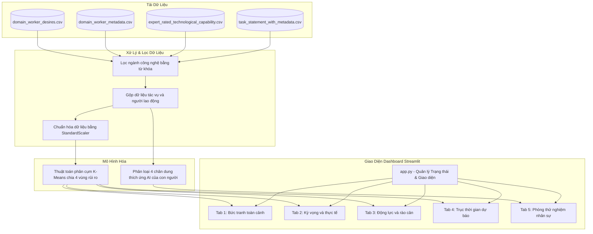

# PHÂN TÍCH TÁC ĐỘNG CỦA AI ĐỐI VỚI NGÀNH CÔNG NGHỆ VÀ DỮ LIỆU

Dự án này là một ứng dụng dashboard phân tích dữ liệu tương tác được phát triển bằng Python và Streamlit. Ứng dụng cung cấp các góc nhìn đa chiều về tác động của các mô hình ngôn ngữ lớn (LLM) và các hệ thống AI đối với lực lượng lao động công nghệ và dữ liệu, giúp các cá nhân định vị bản thân và các tổ chức quản trị rủi ro công nghệ hiệu quả.

## Mô tả ngắn gọn

Dự án sử dụng dữ liệu khảo sát người lao động và đánh giá của các chuyên gia để thực hiện:
- Lọc và phân tích các nhóm nghề nghiệp liên quan đến Công nghệ thông tin (IT) và Dữ liệu.
- Sử dụng thuật toán phân cụm K-Means để chia nhóm các tác vụ công việc thành 4 vùng rủi ro tự động hóa khác nhau (Safe zone, Stable zone, At-risk zone, Alert zone).
- Phân nhóm lực lượng lao động thành 4 chân dung nhân sự (Strategic power user, Traditional domain expert, Adaptive tech adopter, Replaceable tech dependent) dựa trên thâm niên, mức lương và hành vi ứng dụng AI trong thực tế.
- Dự báo xu thế phát triển của tự động hóa đến năm 2030 dựa trên mô hình tăng trưởng lũy tiến và đưa ra lộ trình chuyển đổi kỹ năng.
- Cung cấp phòng thử nghiệm tương tác cho cá nhân tự đánh giá kỹ năng và cho nhà quản trị mô phỏng rủi ro thích ứng công nghệ của phòng ban tổ chức.

## Các tính năng chính

- Trang 1: Bức tranh toàn cảnh (Industry overview)
  Cung cấp thống kê tổng quan về lực lượng lao động tham gia khảo sát, tỷ lệ phân bổ thâm niên kinh nghiệm làm việc, so sánh tỷ lệ sử dụng LLM theo giới tính và phân tích hiện tượng Dunning-Kruger kỹ thuật số giữa nhóm nhân sự Junior và Senior.

- Trang 2: Kỳ vọng và thực tế (Expectation vs. reality)
  Trực quan hóa ma trận định vị chiến lược tác vụ bằng thuật toán phân cụm K-Means, chỉ ra các tác vụ có khoảng cách kỳ vọng chênh lệch lớn nhất giữa mong muốn của lập trình viên và năng lực thực tế của AI, đồng thời đối chiếu ranh giới phân cực của các tác vụ cực đoan.

- Trang 3: Động lực và rào cản (Drivers & barriers)
  Đánh giá cường độ động lực thúc đẩy tự động hóa của người lao động, phân tích rào cản phòng thủ phi kỹ thuật (mức độ bất định của công việc và yêu cầu giao tiếp xã hội), và biểu diễn tọa độ đa biến các thuộc tính kỹ năng của nhóm tác vụ phân cực.

- Trang 4: Trục thời gian và dự báo (Temporal & forecasting)
  Mô phỏng đà tăng trưởng năng lực tự động hóa lũy tiến của AI Agent đến năm 2030 theo thời gian thực. Cung cấp la bàn định hướng và công cụ gợi ý lộ trình chuyển dịch sang các tác vụ có độ bảo vệ cao hơn trong cùng nhóm ngành.

- Trang 5: Phân khúc và định hình chân dung (Human segmentation)
  Tích hợp la bàn đánh giá vị thế sự nghiệp cá nhân (so sánh trực tiếp với hình mẫu chuyên gia bằng biểu đồ radar đè lớp) và cung cấp hộp cát mô phỏng (Sandbox) sức khỏe nhân sự phòng ban tổ chức, tự động tính toán chỉ số rủi ro thích ứng và đưa ra cảnh báo sớm cùng lộ trình hành động.

## Hướng dẫn cài đặt và chạy thử

### Yêu cầu hệ thống

Hệ thống cần cài đặt sẵn Python phiên bản từ 3.8 trở lên.

### Các bước cài đặt

1. Tải mã nguồn của dự án về máy tính hoặc clone từ GitHub:
   ```bash
   git clone https://github.com/username/project-name.git
   cd project-name
   ```

2. Tạo môi trường ảo hóa Python để quản lý thư viện độc lập:
   ```bash
   python -m venv .venv
   ```

3. Kích hoạt môi trường ảo:
   - Trên Windows (PowerShell):
     ```powershell
     .venv\Scripts\Activate.ps1
     ```
   - Trên macOS / Linux:
     ```bash
     source .venv/bin/activate
     ```

4. Cài đặt các thư viện phụ thuộc từ file requirements.txt:
   ```bash
   pip install -r requirements.txt
   ```

### Hướng dẫn chạy ứng dụng

Khởi chạy ứng dụng Streamlit tại thư mục gốc của dự án bằng lệnh:
```bash
streamlit run app.py
```

Ứng dụng sẽ tự động mở trên trình duyệt web mặc định tại địa chỉ Local: `http://localhost:8501`.

## Cấu trúc thư mục

Dự án được tái cấu trúc theo mô hình mô-đun chuẩn như sau:

```text
.
├── assets/
│   └── style.css            # File định nghĩa giao diện và các CSS tùy chỉnh
├── data/
│   ├── domain_worker_desires.csv
│   ├── domain_worker_metadata.csv
│   ├── expert_rated_technological_capability.csv
│   └── task_statement_with_metadata.csv
├── src/
│   ├── __init__.py          # Khởi tạo package nguồn
│   ├── data_loader.py       # Tải dữ liệu, lọc ngành nghề, phân cụm K-Means và phân loại chân dung
│   ├── ui_components.py     # Chứa các component UI dùng chung và cấu hình biểu đồ Plotly
│   └── tabs/
│       ├── __init__.py      # Khởi tạo package các tab giao diện
│       ├── tab_general.py   # Tab 1: Tổng quan số liệu và thâm niên
│       ├── tab_demand.py    # Tab 2: Kỳ vọng tự động hóa và ma trận phân cụm
│       ├── tab_risk.py      # Tab 3: Động lực thúc đẩy và rào cản kỹ năng phi kỹ thuật
│       ├── tab_vulnerability.py # Tab 4: Dự báo tăng trưởng tự động hóa và la bàn kỹ năng
│       └── tab_sandbox.py   # Tab 5: La bàn sự nghiệp cá nhân và hộp cát mô phỏng tổ chức
├── .gitignore               # Khai báo các file bỏ qua không commit lên git
├── app.py                   # File khởi chạy chính của dashboard Streamlit
├── LICENSE                  # Bản quyền MIT License của dự án
├── requirements.txt         # Danh sách các thư viện Python phụ thuộc
└── README.md                # Tài liệu hướng dẫn sử dụng dự án
```

## Sơ đồ luồng dữ liệu (Dataflow)

Luồng dữ liệu trong dự án được tổ chức và luân chuyển như sau:



## Bản quyền

Dự án này được phân phối dưới dạng mã nguồn mở theo các điều khoản của MIT License. Chi tiết vui lòng tham khảo file LICENSE đính kèm.
