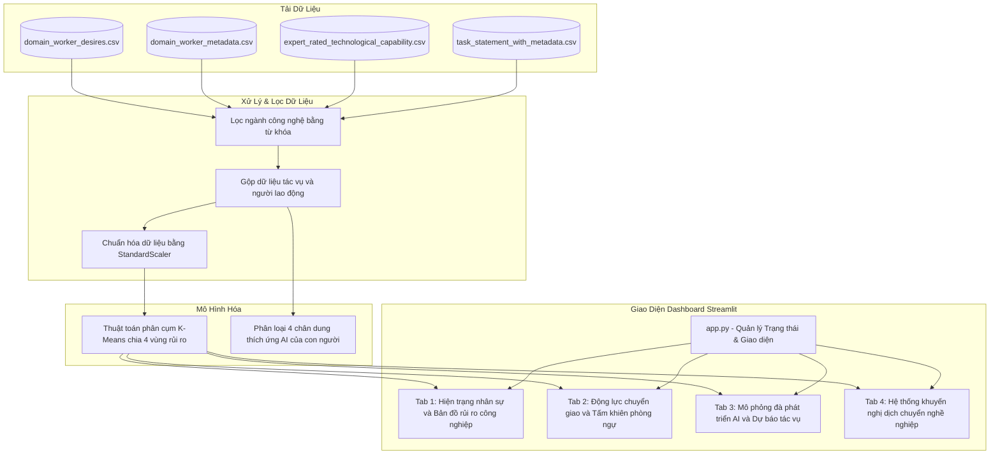

# PHÂN TÍCH TÁC ĐỘNG CỦA AI ĐỐI VỚI NGÀNH CÔNG NGHỆ VÀ DỮ LIỆU

Dự án này là một ứng dụng dashboard phân tích dữ liệu tương tác được phát triển bằng Python và Streamlit. Ứng dụng cung cấp các góc nhìn đa chiều về tác động của các mô hình ngôn ngữ lớn (LLM) và các hệ thống AI đối với lực lượng lao động công nghệ và dữ liệu, giúp các cá nhân định vị bản thân và các tổ chức quản trị rủi ro công nghệ hiệu quả.

## Mô tả ngắn gọn

Dự án sử dụng dữ liệu khảo sát người lao động và đánh giá của các chuyên gia để thực hiện:
- Lọc và phân tích các nhóm nghề nghiệp liên quan đến Công nghệ thông tin (IT) và Dữ liệu.
- Sử dụng thuật toán phân cụm K-Means để chia nhóm các tác vụ công việc thành 4 vùng rủi ro tự động hóa khác nhau (Safe zone, Stable zone, At-risk zone, Alert zone).
- Phân tích và dự báo rủi ro tự động hóa của từng tác vụ công việc bằng thuật toán phân cụm K-Means.
- Tính toán chỉ số sẵn sàng và lộ trình phát triển AI tại Mỹ so với Việt Nam đến năm 2030.
- Cung cấp la bàn dịch chuyển sự nghiệp dựa trên Chỉ số tương đồng kỹ năng Jaccard và bộ lọc bảo vệ thu nhập.

## Các tính năng chính

- Trang 1: Hiện trạng nhân sự và Bản đồ rủi ro công nghiệp
  Cung cấp thống kê tổng quan về lực lượng lao động IT tham gia khảo sát, tỷ lệ phân bổ thâm niên kinh nghiệm làm việc, và ma trận định vị chiến lược tác vụ bằng thuật toán phân cụm K-Means.

- Trang 2: Động lực chuyển giao và Tấm khiên phòng ngự con người
  Đánh giá cường độ động lực thúc đẩy tự động hóa của người lao động, phân tích rào cản phòng thủ phi kỹ thuật (mức độ bất định của công việc và yêu cầu giao tiếp xã hội), và đối chiếu thói quen sử dụng LLM của nhóm Junior vs Senior (Dunning-Kruger/Bẫy năng lực AI).

- Trang 3: Mô phỏng đà phát triển AI và dự báo rủi ro tác vụ
  Mô phỏng đà tăng trưởng năng lực tự động hóa lũy tiến của AI Agent tại Mỹ (CAGR 24.1%) và Việt Nam (CAGR 20.0% kết hợp với chỉ số AI Readiness) đến năm 2030, tự động phân loại tác vụ (Lệ thuộc AI, Cộng tác AI, Lõi con người).

- Trang 4: Hệ thống khuyến nghị dịch chuyển nghề nghiệp và nâng cao kỹ năng
  Đề xuất top 3 ngành nghề dịch chuyển an toàn dựa trên Chỉ số tương đồng kỹ năng Jaccard và các bộ lọc ràng buộc tối ưu hóa (bảo vệ thu nhập, rủi ro thấp hơn), đồng thời chỉ rõ lộ trình đào tạo (tác vụ sẵn có vs kỹ năng cần học).

## Hướng dẫn cài đặt và chạy thử

### Yêu cầu hệ thống

Hệ thống cần cài đặt sẵn Python phiên bản từ 3.8 trở lên.

### Các bước cài đặt

1. Tải mã nguồn của dự án về máy tính hoặc clone từ GitHub:
   ```bash
   git clone https://github.com/username/project-name.git
   cd project-name
   ```

2. Tạo môi trường ảo hóa Python để quản lý thư viện độc lập:
   ```bash
   python -m venv .venv
   ```

3. Kích hoạt môi trường ảo:
   - Trên Windows (PowerShell):
     ```powershell
     .venv\Scripts\Activate.ps1
     ```
   - Trên macOS / Linux:
     ```bash
     source .venv/bin/activate
     ```

4. Cài đặt các thư viện phụ thuộc từ file requirements.txt:
   ```bash
   pip install -r requirements.txt
   ```

### Hướng dẫn chạy ứng dụng

Khởi chạy ứng dụng Streamlit tại thư mục gốc của dự án bằng lệnh:
```bash
streamlit run app.py
```

Ứng dụng sẽ tự động mở trên trình duyệt web mặc định tại địa chỉ Local: `http://localhost:8501`.

## Cấu trúc thư mục

Dự án được tái cấu trúc theo mô hình mô-đun chuẩn như sau:

```text
.
├── assets/
│   └── style.css            # File định nghĩa giao diện và các CSS tùy chỉnh
├── data/
│   ├── domain_worker_desires.csv
│   ├── domain_worker_metadata.csv
│   ├── expert_rated_technological_capability.csv
│   └── task_statement_with_metadata.csv
├── src/
│   ├── __init__.py          # Khởi tạo package nguồn
│   ├── data_loader.py       # Tải dữ liệu, lọc ngành nghề bằng regex và phân cụm K-Means
│   ├── ui_components.py     # Chứa các component UI dùng chung và cấu hình biểu đồ Plotly
│   └── tabs/
│       ├── __init__.py      # Khởi tạo package các tab giao diện
│       ├── tab_general.py   # Tab 1: Hiện trạng nhân sự và Bản đồ rủi ro công nghiệp
│       ├── tab_risk.py      # Tab 2: Động lực chuyển giao và Tấm khiên phòng ngự con người
│       ├── tab_vulnerability.py # Tab 3: Mô phỏng đà phát triển AI và dự báo rủi ro tác vụ
│       └── tab_recommendation.py # Tab 4: Hệ thống khuyến nghị dịch chuyển nghề nghiệp và nâng cao kỹ năng
├── .gitignore               # Khai báo các file bỏ qua không commit lên git
├── app.py                   # File khởi chạy chính của dashboard Streamlit
├── LICENSE                  # Bản quyền MIT License của dự án
├── requirements.txt         # Danh sách các thư viện Python phụ thuộc
└── README.md                # Tài liệu hướng dẫn sử dụng dự án
```

## Sơ đồ luồng dữ liệu (Dataflow)

Luồng dữ liệu trong dự án được tổ chức và luân chuyển như sau:



## Bản quyền

Dự án này được phân phối dưới dạng mã nguồn mở theo các điều khoản của MIT License. Chi tiết vui lòng tham khảo file LICENSE đính kèm.
